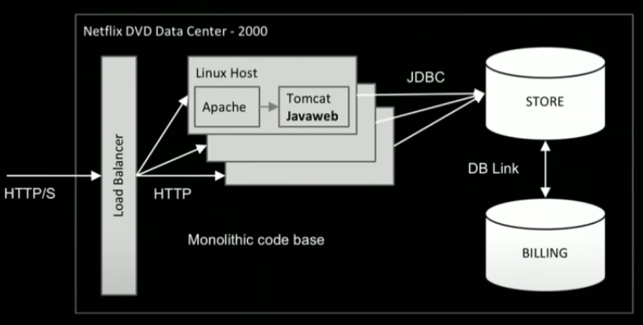
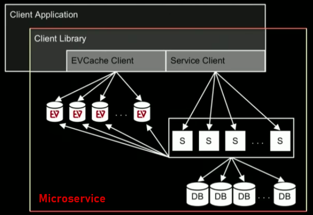
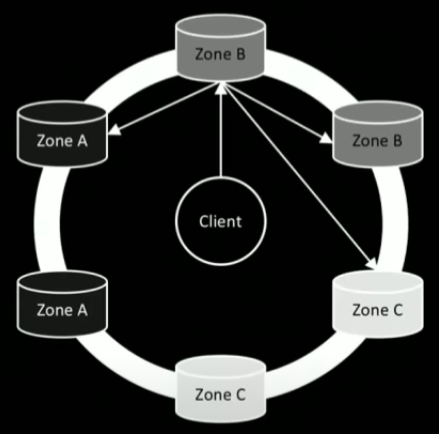
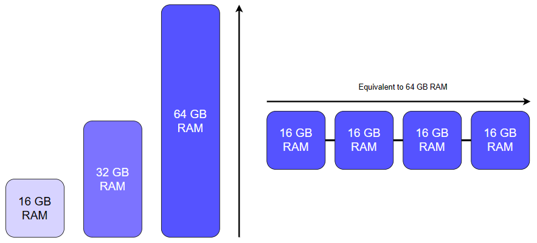
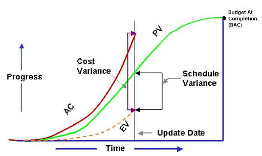
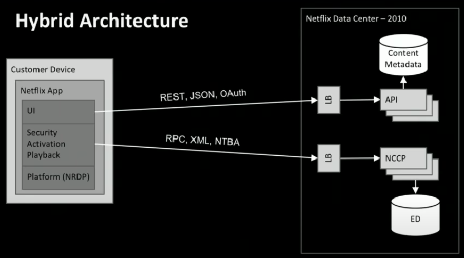
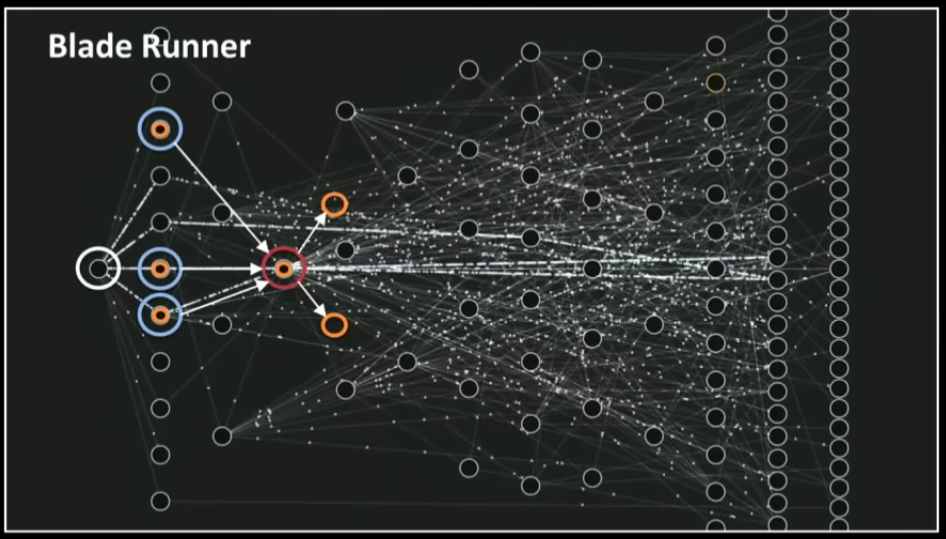

# Report - Mastering Chaos, A Netflix Guide to Microservices
## Begins of Netflix and its monolithic architecture

<p align="center" style="margin-bottom: 0px !important;">
  
</p>

In the 2000’s, with the beginning of Netflix they opted to make the whole system of its company with the monolithic architecture. With everybody contributing to one single codebase there was plenty of difficulties, between them was the difficult to diagnose errors caused when a change was introduced, troubleshooting that taking pieces of code, running isolated tests and more took extended periods of time and a big team. <br>

Their database was also monolithic, one single hardware, running one big Oracle database. The main problem: when this went down, all the business went down. Also, as demand increases, more and bigger hardware were needed to afford with their demand, so regardless of options they seem obligated to vertically scales its resources. <br>

This is a good example of **how not** to build a services-based company today. <br>

## What are microservices ?
```The microservice architecture style is an approach to developing a single application as a suit of small services, each running in its own process and communicating with lightweight mechanisms, often an HTTP resource API.  -Martin Fowler``` <br>

Resiliency, isolation and scalability are some of the requirements intended for the new kind of application architectures. With this in mind a group of software architects created the term “microservices” in 2012, but didn’t became well known until Martin Fowler, software developer and known author of the community, started using the term in some of his web page publications. <br>

The services are built according to the capabilities of the business and are deployed independently by a fully automated deployment mechanism. There is minimal centralized management of these services, which may be written in different programming languages and use different data storage technologies. <br>

There were several critical things that encourages the software architects to create the microservices style there are:
-	Separation of concerns: Modularity and encapsulation. Being capable to isolate data structures behind something that deals with all the components coordination. 
-	Scalability: Horizontal scaling and workload partitioning. Increasing application capacity by adding machines to the system and then to balance the workload, as a distributed system, break the work in to smaller components so it can be more manageable.   
-	Virtualization and elasticity: Microservices are way to easier to manage in this kind of virtualized environment, because there is needed to automate operations as well the on-demand provisioning.

## Microservices and abstraction
Microservices are essentially an abstraction. From a simple point of view this kind of system may look like a horizontal scaled microservice, but it's not that simple. Database, stored data, service client, client cache all of it are a bunch of machines working together responding to the client’s application in which are embedded. 

<p align="center" style="margin-bottom: 0px !important;">
  
</p>

Its important to realize that this set of technologies is a microservice, not this simple stateless thing which is nice from a user perspective, but it actually has these sorts of complex structures. 

## Cascading failure and Histrix
This disaster scenario in which one service fails and make others to fail too. Improper defenses cause a service to fail and scale to a cascade failure which can ends taking down the entire service. One single service may not affect severely the others, but actually increases the probability that the others components does, the more components fail, the greater the probability of a service failure.

To deal with this Netflix created Hystrix, a library designed to control the interactions between these distributed services, it was created and evolved out of the need for resiliency, greater tolerance of latency and failure. It does this by isolating points of access between the services, stopping cascading failures across them, and providing fallback options, all of which improve the system’s overall resiliency.

<p align="center" style="margin-bottom: 0px !important;">
  
</p>

## Critical services
Microservices have two types of importance in services: normal services and critical services. The first ones are all that give added value to the service but are not essential, this is the main difference with the seconds, these are necessary to have the basic functionality work.

## Network Partition
In the presence of a network partition, must be choose between consistency and availability. What if a connection to some component can’t be reached, its better to just let it fail and give back an error, or connect to the ones can be reached and then fix it up backwards.

Netflix choose the latter and solve this by using the NoSQL distributed database Cassandra, embracing the concept of “Eventual Consistency”, which means the ensuring that the updates made to distributed NoSQL databases will eventually be reflected across all nodes.

<p align="center" style="margin-bottom: 0px !important;">
  
</p>

## Scaling
Capacity of handling rapid changes to workloads and user demands by increasing the number of components and/or their power. There are two types of scaling: <br>
1. **Vertical scaling** means adding more resources to the existing nodes. Is often the simplest solution as it doesn’t require any complex code extensions or configurations, you are just increasing the available computational power, RAM, and bandwidth of the existing nodes.
2. **Horizontal scaling** refers to adding more nodes, such as servers or routers, of comparable hardware to increase the available resources of a system. It is much easier and cost-effective to add more servers and/or set up additional data centers than make one server extremely powerful.
3. **Hybrid scaling** overcome the limitations of vertical and horizontal scaling by incorporating elements of both strategies allowing businesses to scale either need performance or additional capacity. By strategically balancing vertical and horizontal scaling, organizations can optimize costs based on their specific workload and at the same time providing redundancy by using multiple servers, reducing the risk of system failures and ensuring high availability.

<p align="center" style="margin-bottom: 0px !important;">
  
</p>

- **Stateful services**: databases and caches, maintains an internal state that records information about sessions, transactions or any other interactions. These services can be returned to again and again without losing data. Store additional information server-side, on the bank’s server, recording the state of the current transaction and waiting for the next instructions.
- **Stateless services**: frequently accessed metadata, as it is cached in memory is one of the few non-volatile pieces of information that this kind keeps. Store additional information client-side, in your web browser, passing along additional information with each step ‘reminding’ the server of the previous steps.
Losing a node is a non-event, because it recovers very quickly just by booting up a new one to replace de bad node.

## Cost and Scheduled Variance
Cost variance, also known as budget variance, deals with the budget of the software development. Is the difference of the actual cost and the budgeted cost or in other words it is difference between what was expected to be spent and what was actually spent.

Schedule variance is basically used to indicate whether a project is running ahead or behind. It is the difference of Budgeted Cost of Work Performed (BCWP) and Budgeted Cost of Work Scheduled (BCWS). Schedule variance is computed by calculating the difference between Earned Value and Planned Value.

<p align="center" style="margin-bottom: 0px !important;">
  
</p>

## Before stream existed = electronic delivery
In the early days Netflix had a team called electronic delivery, that was the first version of streaming. This first version of the system was developed under the same organization, the client team and the server team were working really tight releasing this design:

<p align="center" style="margin-bottom: 0px !important;">
  
</p>

But in parallel, the Netflix API was created for the DVD business to try and stimulate external applications that would drive traffic back to Netflix, and really happens a thousand of new videos business were born but it didn’t generate a huge amount of value to Netflix. <br>
However, this API actually helped with their UI innovation, containing content metadata about all the movies that were available, with a generalized REST API, JSON schema, HTTPS responses, XML, an Oauth security end more, feeling like a much modern architecture.

<p align="center" style="margin-bottom: 0px !important;">
  
</p>

## Conway’s Law
Organizations which design systems are constrained to produce designs which are copies of the communication structures of its organization.

```Any piece of software reflects the organizational structure that produced it```

Netflix realized that solutions aren’t first, organization is first for driving the architecture they had. Components like the API, NCCP, gateway, legacy devices all that mess means nothing without a right organization, and for that they developed an architecture called “Blade Runner”. Decomposing capabilities of certain components and integrating them in others, so the appropriate piece were pushed in to a new smaller microservices that contained more fundamental capabilities. 

<p align="center" style="margin-bottom: 0px !important;">
  
</p>

## Outcomes and Lessons
- **Outcomes**
  + Productivity and new capabilities by unifying the components
  + Refactored team organization when API's were introduced to suit better the new technologies

 - **Lessons**
   + Solutions first, teams second
   + Reconfigure teams to best support the architecture


## References
- Mastering Chaos - A Netflix Guide to Microservices
https://www.youtube.com/watch?v=CZ3wIuvmHeM
- Microservicios y arquitectura de microservicios
https://www.intel.la/content/www/xl/es/cloud-computing/microservices.html
- ¿Qué son los microservicios?
https://aws.amazon.com/es/microservices/#:~:text=Caracter%C3%ADsticas%20de%20los%20microservicios&text=Cada%20servicio%20componente%20en%20una,o%20implementaciones%20con%20otros%20servicios.
- How Failures Cascade in Software Systems
https://scholarsarchive.byu.edu/cgi/viewcontent.cgi?article=10483&context=etd
- Introducing Hystrix for Resilience Engineering
https://netflixtechblog.com/introducing-hystrix-for-resilience-engineering-13531c1ab362
- What is eventual consistency?
https://www.voltactivedata.com/blog/2022/09/what-is-eventual-consistency/
- Stateful vs Stateless Architecture
https://www.virtasant.com/blog/stateful-vs-stateless-architecture-why-stateless-won
- Scalability
https://www.educative.io/blog/scalable-systems-101#scalability
- Cost Variance (CV) and Schedule Variance (SV)
https://www.geeksforgeeks.org/software-engineering-cost-variance-cv-and-schedule-variance-sv/
- Conway’s Law
https://www.atlassian.com/blog/teamwork/what-is-conways-law-acmi
