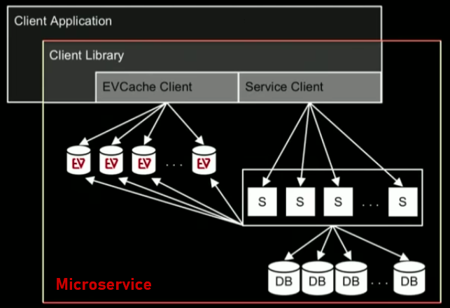

# Report - Mastering Chaos, A Netflix Guide to Microservices
## Begins of Netflix and its monolithic architecture

<p align="center" style="margin-bottom: 0px !important;">
  
</p>

In the 2000’s, with the beginning of Netflix they opted to make the whole system of its company with the monolithic architecture. With everybody contributing to one single codebase there was plenty of difficulties, between them was the difficult to diagnose errors caused when a change was introduced, troubleshooting that taking pieces of code, running isolated tests and more took extended periods of time and a big team. <br>

Their database was also monolithic, one single hardware, running one big Oracle database. The main problem: when this went down, all the business went down. Also, as demand increases, more and bigger hardware were needed to afford with their demand, so regardless of options they seem obligated to vertically scales its resources. <br>

This is a good example of **how not** to build a services-based company today. <br>

## What are microservices ?
```The microservice architecture style is an approach to developing a single application as a suit of small services, each running in its own process and communicating with lightweight mechanisms, often an HTTP resource API.  -Martin Fowler``` <br>

Resiliency, isolation and scalability are some of the requirements intended for the new kind of application architectures. With this in mind a group of software architects created the term “microservices” in 2012, but didn’t became well known until Martin Fowler, software developer and known author of the community, started using the term in some of his web page publications. <br>

The services are built according to the capabilities of the business and are deployed independently by a fully automated deployment mechanism. There is minimal centralized management of these services, which may be written in different programming languages and use different data storage technologies. <br>

There were several critical things that encourages the software architects to create the microservices style there are:
-	Separation of concerns: Modularity and encapsulation. Being capable to isolate data structures behind something that deals with all the components coordination. 
-	Scalability: Horizontal scaling and workload partitioning. Increasing application capacity by adding machines to the system and then to balance the workload, as a distributed system, break the work in to smaller components so it can be more manageable.   
-	Virtualization and elasticity: Microservices are way to easier to manage in this kind of virtualized environment, because there is needed to automate operations as well the on-demand provisioning.

## Microservices and abstraction
Microservices are essentially an abstraction. From a simple point of view this kind of system may look like a horizontal scaled microservice, but its not that simple. Database, stored data, service client, client cache all of it are a bunch of machines working together responding to the client’s application in which are embedded. 

<p align="center" style="margin-bottom: 0px !important;">
  
</p>

