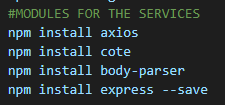
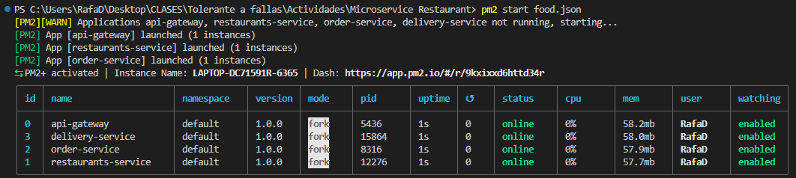
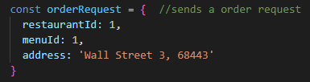
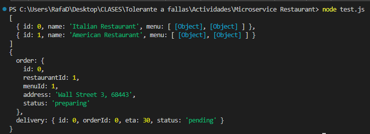

# MICROSERVICE ACCESSIBLE WITH NODE.JS & DOCKER / PM2
An example of microservices implementation of a restaurant that process orders and deliveries.

## Requeriments
### PM2
```
npm install
RUN npm i -g pm2  
RUN npm install -g nodemon
```
### Services Modules
<p align="center" style="margin-bottom: 0px !important;">
  
</p>

## Quickstart
### Docker - Developing mode, live-reload changes
```
cd "Microservice Restaurant"
docker-compose up
```
#### Test example request
```
node test.js
```

### PM2 - Production process manager,  manage and keep an application online
```
pm2 start food.json
pm2 plus  (this runs the Monitoring Web Interface)
```

## TEST RESULTS - PM2
First, run the process manager PM2 with a .json file containing the gateway and services names
<p align="center" style="margin-bottom: 0px !important;">
  
</p>

### Test Results
Execute a node with the **test.js** file, this sends a request to the restaurant service, with the following order to an specific restaurant:
<p align="center" style="margin-bottom: 0px !important;">
  
</p>

Then pass it to the delivery service in which it gaves an ID_delivery and set the delivery status to pending:
<p align="center" style="margin-bottom: 0px !important;">
  
</p>
