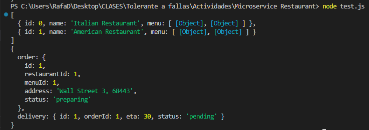

# MICROSERVICE ACCESSIBLE WITH NODE.JS & DOCKER / PM2
An example of microservices implementation of a restaurant that process orders and deliveries.

## Requeriments
### PM2
```
npm install
RUN npm i -g pm2  
RUN npm install -g nodemon
```
### Serives Modules
<p align="center" style="margin-bottom: 0px !important;">
  
</p>

## Quickstart
### Docker - Developing mode, live-reload changes
```
cd "Microservice Restaurant"
docker-compose up
```

### PM2 - Production process manager,  manage and keep an application online
```
pm2 start food.json
pm2 plus  (this runs the Monitoring Web Interface)
```

## TEST RESULTS - PM2
<p align="center" style="margin-bottom: 0px !important;">
  
</p>
<p align="center" style="margin-bottom: 0px !important;">
  
</p>
<p align="center" style="margin-bottom: 0px !important;">
  
</p>
