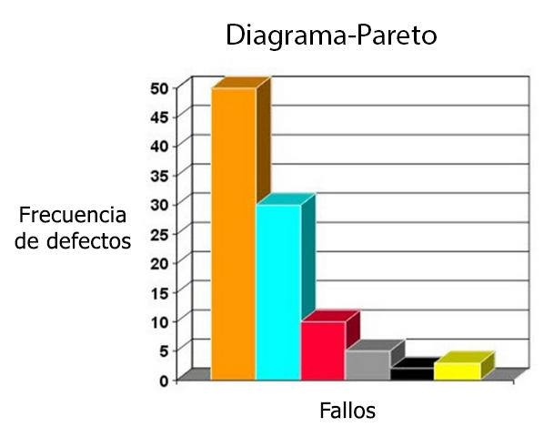
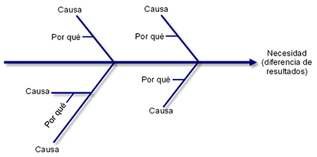

## Métodos/técnicas para la prevención de defectos

El asegurar la funcionalidad de un sistema en buena parte depende de la identificación y prevención de los defectos que este mismo pueda presentar. La fase de prevención 
de defectos es crucial ya que minimiza el porcentaje de errores conservando recursos y tiempo a la larga ya que evita el arreglar errores que pudieron haber sido prevenidos.  
Algunas maneras de llevar a cabo esto son:

1.	**Revisión de la especificación de requisitos**  
Después de comprender los requisitos del cliente, se debe analizar cuál es la esencia de estos para poder cumplirlos de la manera más acertada posible.
Una revisión es importante en este paso: el primer nivel de revisión debe estar dentro del equipo, seguido de otro nivel de revisión externa (por un desarrollador o cliente)
para asegurarse de que todas las perspectivas estén sincronizadas.

2.	**Revisión de diseño**  
Esta revision garantizará que el equipo de control de calidad comprenda los pros y los contras de cada estrategia al predecir los posibles riesgos y fallas del producto.
Este tipo de recorrido crítico ademas de sopesar la viabilidad de las estrategias tambien ayuda a descubrir cualquier problema con las mismas y solucionarlo antes de seguir adelante.

3.	**Análisis de Pareto**  
Una técnica formal y simple que ayuda a priorizar el orden de resolución del problema para lograr el máximo impacto. Afirma que el 80% del problema surge por razones del 20%.
Por lo que una vez identificados, se priorizan de acuerdo con la frecuencia y se realiza un análisis estadístico para encontrar cuales son este 20% de razones que se atribuyen la mayoria
de los problemas.

  

4. **Análisis de causa raíz/espina de pescado**  
Es una tecnica de causa y efecto que sirve como estructura para debates de grupo sobre las posibles causas de un problema. Al analizar en profundidad las necesidades es que se pueden reflejar las causas potenciales de un problema creando una representación visual de causas, categorías de causas y necesidades que es el diagrama de espina de pescado:

  

## ¿Qué es Orthogonal Defect Classification (ODC)?  
Es una tecnica de clasificacion de defectos que se utiliza para analizar y categorizar los defectos que se encuentran durante el desarrollo de software. El analisis de ODC provee un metodo de diagnostico para evaluar las fases del ciclo de desarrollo 
(diseño, desarrollo, pruebas y servicio) y la madurez del proyecto con el objetivo de mejorar la calidad y eficiencia en el desarrollo del mismo a lo largo del tiempo.  
### Proceso:  

1. **Recopilación de defectos**: El primer paso consiste en recopilar información sobre los defectos o problemas encontrados en el software. Estos defectos pueden provenir de pruebas de calidad, revisiones de código, informes de usuarios.

2. **Definición de categorías**: Se establece un conjunto de categorías o dimensiones predefinidas en las que se clasificarán los defectos, estas pueden incluir aspectos como funcionalidad, rendimiento, seguridad, interfaz de usuario, etc. Cada categoría debe estar bien definida y ser mutuamente excluyente.

3. **Clasificación de defectos**: Los defectos recopilados se clasifican en las categorías definidas. Cada defecto se etiqueta con la categoría o categorías que mejor describan su naturaleza, esto implica una revisión y análisis de los defectos para asignarles las etiquetas apropiadas.

4. **Registro de datos**: Se registra la información detallada de cada defecto, incluyendo su categoría, gravedad, fecha de detección, estado actual, descripción, y cualquier otra información relevante. Esto se hace en una base de datos o sistema de seguimiento de defectos.

5. **Análisis y reporte**: Con los datos registrados, se pueden realizar análisis para identificar patrones, tendencias y áreas críticas del software que requieren atención. También se pueden generar informes que resuman la distribución de defectos por categoría, gravedad, etc.

6. **Acciones correctivas y mejora continua**: Basándose en los resultados del análisis, se pueden tomar acciones para abordar los defectos identificados como lo son correcciones de código, ajustes en procesos de desarrollo o mejoras en la gestión de calidad. El objetivo es reducir la cantidad de defectos y mejorar la calidad del software.

7. **Seguimiento y retroalimentación**: Se realiza un seguimiento continuo de los defectos, incluyendo su resolución y el impacto de las acciones correctivas. La retroalimentación obtenida se utiliza para mejorar los procesos de desarrollo y la efectividad de la técnica ODC en futuros proyectos.

### Bibliografia
- https://www.mtp.es/blog/testing-software/prevencion-de-defectos-en-el-aseguramiento-de-la-calidad-del-software/
- https://vates.com/como-evitar-errores-de-software-durante-la-fase-de-desarrollo/
- https://www.esss.co/es/blog/fiabilidad-en-revision-del-diseno-de-conjuntos-electronicos/#:~:text=Una%20revisi%C3%B3n%20del%20dise%C3%B1o%20es,las%20fases%20finales%20de%20desarrollo.
- https://ieeexplore.ieee.org/document/9370747
- https://researcher.watson.ibm.com/researcher/view_group.php?id=480
