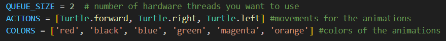
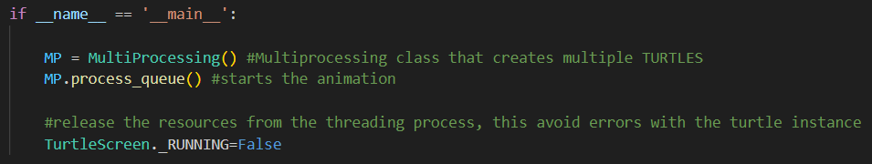
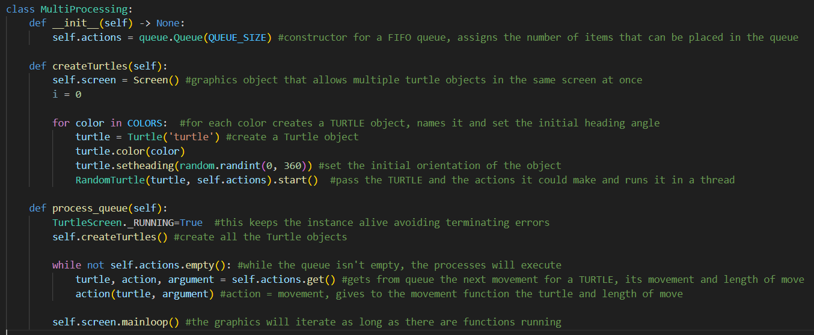
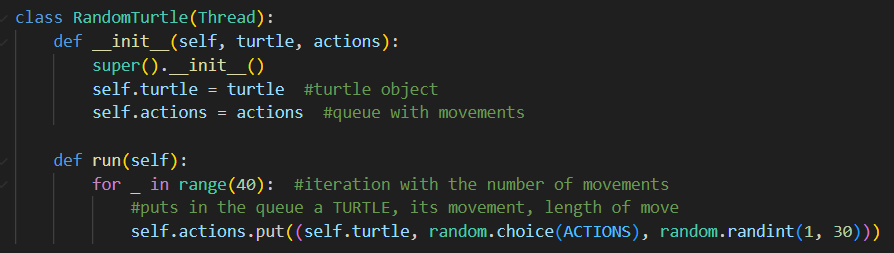
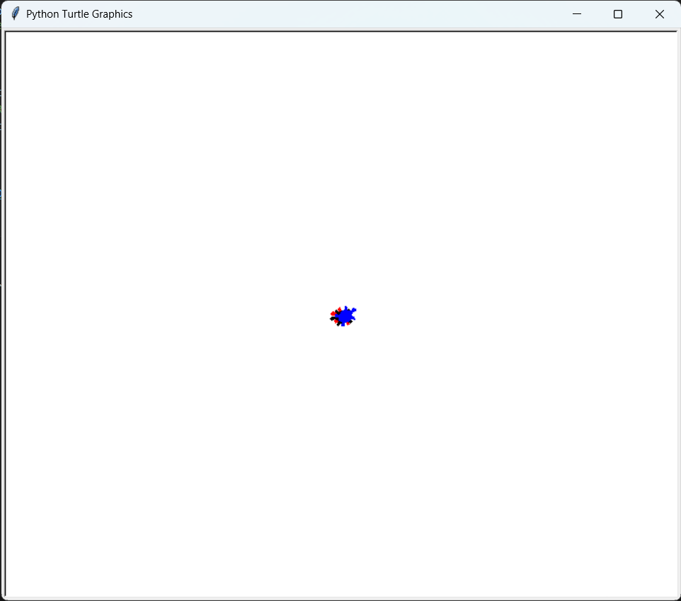
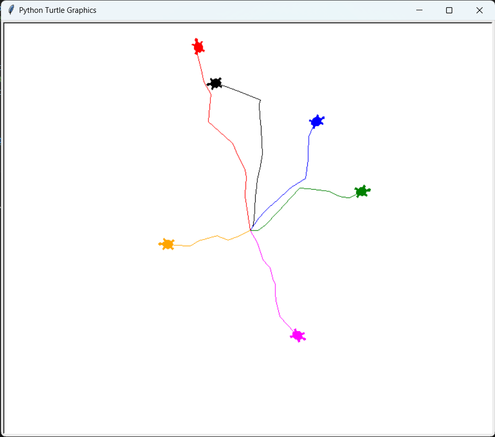

## Objects animation running in threads with 'Turtle' module

### Turtle graphics
Python library that enables users to create pictures and shapes by providing a virtual canvas and basic drawing tools.  
The onscreen pen that you use for drawing is called the turtle.  
Documentation: [Turtle Graphics](https://docs.python.org/es/3/library/turtle.html)

### App Development
This app uses 3 main modules: **Turtle**, **Thrading** and **Queue**.  

Constants:

  

Steps:
1. The main function calls **Multiprocessing()** to create the Queue in which will be stored all the threads animation actions during the execution. And calls **createTurtles** to create all the animation objects.
2. Then creates **n** turtle objects, one per color defined in constant **COLORS** giving it a color, a position and the actions it could make.
3. Then starts the execution in a thread, one per turtle, while it could make **n** movements (defined in constructor) and therefore the Queue isn't empty, pick a turtle and an action from **ACTIONS**
   and makes the turle to do the animation. All this in the displayed screen.

Code:

  

  

  

## Results:
### BEGIN

  

### END

  

