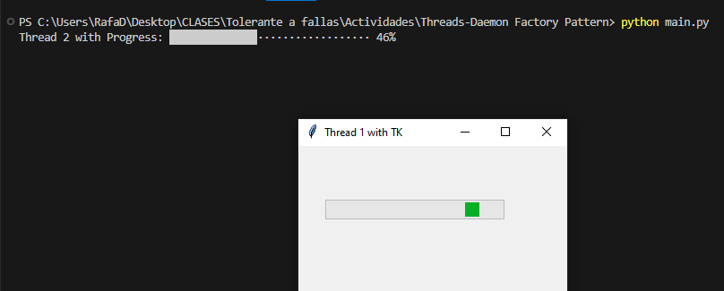

# Threads & Deamons demonstration using Factory Design Pattern
Thread: ```Sequence of programmed instructions that can be managed independently by a scheduler. In many cases, a thread is a component of a process.``` <br>
Daemon: ```Program that runs continuously as a background process and wakes up to handle periodic service requests, which often come from remote processes.``` <br>
Factory Pattern: ```Creational design pattern which gives an interface to create objects in a superclass, while allows their subclasses to modify the kind of objects that will be created.``` <br>

### Requeriments
```
Module for the progression bar of the 2nd thread:  pip install progress
```

----
The following program demonstrate how the threads and daemons works together to run more than one process at the same time. The creation of the thread objects are made by the factory method,
from a parent class **FactoryClass** gets the name of the thread and create the object with the arguments below (this for all the threads):

```python
thread_obj_1 = threading.Thread(
    name="Custom Thread 1",
    target=thread_handler.thread_handler,
    args=("thread_number_1", ),
    daemon=True
)
```
```python
def thread_handler(thread_name):
    #  get and create the object
    factory_obj = FactoryClass.get_class(thread_name)
    
    factory_obj.run()
```
----
Once created, this is how it starts:
```python
# start threads running
thread_obj_1.start()
thread_obj_2.start()

while(True): # check if the thread is alive (finish if one of them stops)
    time.sleep(1)
    if thread_obj_2.is_alive() == None:
        break
    if thread_obj_1.is_alive() == None:
        break
```
----
The processes runs at the same time, while one display a progress bar in a floating window (made with the module **tkinter**), 
the other prints a progress bar (made with module **Progress**) in the terminal:

<p align="center" style="margin-bottom: 0px !important;">
  
</p>

## Usage
Runs from the main method, this creates the threads and keep them alive while the methods are running (runs infinitely)
```
python main.py
```
To stop the execution press **CTRL + C** in the terminal where the **main.py** was called
