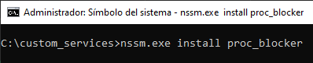

## Service - Application Blocker

How to create a Windows service which checks apps status (using the psutil library in Python)

1. The first step is to create the application we want to deploy as a service, in this case I created an application blocker named [**proc_blocker.py**](https://github.com/Rafa-X/CUCEI-Tolerante-a-fallas/blob/main/Windows%20Services/custom_services/proc_blocker.py). This application gets as an argument the name of the executables of the apps that the user is calling to open, then evaluates if it's one of the blocked apps, specified when the service is installed, and kill it before it starts.

2. Once the service application is ready, there is needed to install the service. In this case made it through the [**NSSM - Non-Sucking Service Manager**](https://nssm.cc/). This free tool allows us to install, start, stop and unistall Windows services through an interface with several tools for setting up the service.
    1) Download the NSSM file and move its .exe to a folder in the C: directory (in this case *C:\custom_services\*)  
       

           
       

    2) 
3. 
